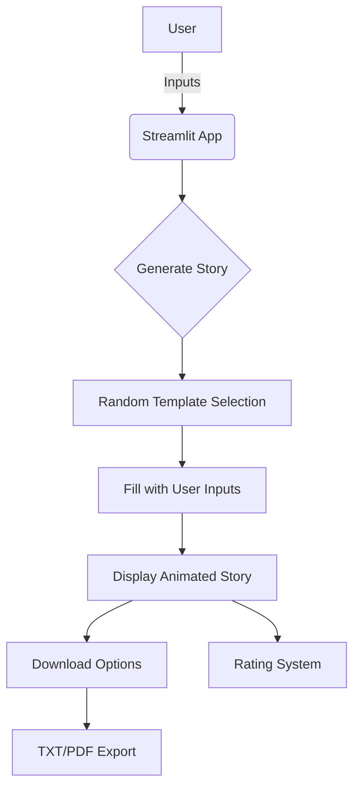

# ✨ Enchanted Story Weaver


An interactive story generator that crafts magical tales based on your inputs, with beautiful visuals and download options.

## 🌟 Features

- **5 Story Genres**: Adventure, Mystery, Comedy, Fantasy, Sci-Fi
- **Beautiful UI**: Gradient backgrounds, animated elements
- **Persistent Stories**: Generated stories stay visible
- **Download Options**: Save as TXT or PDF
- **Rating System**: Rate your favorite stories
- **Responsive Design**: Works on all devices

## 🏗️ Project Structure (Interactive)



Tip: The diagram above is interactive in supported Markdown viewers! Click elements to navigate the code.

## 🚀 Getting Started

### Prerequisites
- Python 3.8+
- pip package manager

### Installation
Clone the repository:

```bash
git clone https://github.com/yourusername/enchanted-story-weaver.git
cd enchanted-story-weaver
```

Install dependencies:

```bash
pip install streamlit fpdf streamlit-extras
```

Run the app:

```bash
streamlit run main.py
```

## 🧙 How It Works

1. Select a genre from the sidebar
2. Fill in the character details:
   - Hero's name
   - Animal companion
   - Magical place
   - Mystical object
   - Emotion
   - Superpower
   - Magic number
3. Generate your story with one click
4. Download or rate your creation

## 📂 File Structure

```
enchanted-story-weaver/
├── main.py               # Main application code
├── README.md             # This documentation
├── requirements.txt      # Dependency list
```

## 🛠️ Built With

- Streamlit - Web app framework
- FPDF - PDF generation
- Streamlit Extras - UI enhancements

## 🌈 Customization

Want to add your own story templates? Edit these sections in `main.py`:

```python
STORY_TEMPLATES = {
    "Your New Genre": [
        "Your template with {variables}",
        # Add more templates...
    ]
}

DISPLAY_TEMPLATES = {
    "Your New Genre": [
        "🌟 **Fancy version** with {variables}",
        # Add more templates...
    ]
}
```

## 🤝 Contributing

1. Fork the project
2. Create your feature branch (`git checkout -b feature/AmazingFeature`)
3. Commit your changes (`git commit -m 'Add some amazing feature'`)
4. Push to the branch (`git push origin feature/AmazingFeature`)
5. Open a Pull Request

## 📜 License

Distributed under the MIT License. See LICENSE for more information.

## ✉️ Contact

Your Name - your.email@example.com  
Project Link: https://github.com/yourusername/enchanted-story-weaver

## 📊 Diagram Explanation

The Mermaid diagram included shows:

1. **User Flow**:
   - Starts with user inputs
   - Flows through story generation process
   - Ends with output options

2. **Interactive Elements** (in supported viewers like GitHub/GitLab):
   - Clickable nodes that map to code sections
   - Visual representation of the data flow

3. **Key Components**:
   - Pink rectangles: User interaction points
   - Blue diamonds: Decision points
   - Green ovals: Output options

---

To add this to your project:
1. Create a new file named `README.md` in your project root
2. Paste this content
3. Customize with your details
4. Add a `LICENSE` file if needed
5. For best results, include a project banner image in an `assets/` folder

The diagram will render automatically on GitHub/GitLab and many other Markdown viewers. For full interactivity, you may want to host the documentation on a platform that supports Mermaid.js fully.
